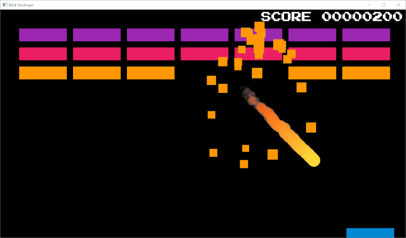
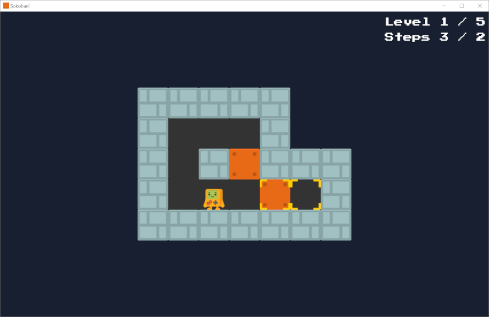
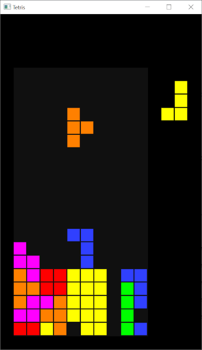
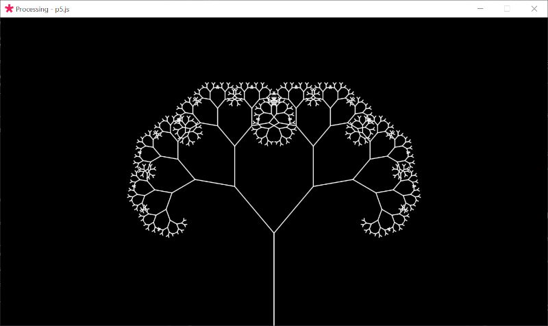

Examples
========

There are a few example applications in the
[`examples`](https://github.com/windowjs/windowjs/tree/main/examples)
directory of the Window.js
[checkout](/dev/checkout#2-checkout-the-repository) from the Github
[repository](https://github.com/windowjs/windowjs).


Breakout
--------

A simple [Breakout](https://en.wikipedia.org/wiki/Breakout_(video_game)) clone,
that was ported from an older HTML5 version.

Use the left and right arrows to move and space to start, or use the mouse and
click to start.

```shell
$ out/windowjs.exe examples/breakout.js
```

Press `F2` to see the FPS and memory usage counters and `F5` to reload.

Pressing the digits 1 to 6 skips ahead to the corresponding level.

<p align="center"></p>


Sokoban
-------

A simple [Sokoban](https://en.wikipedia.org/wiki/Sokoban) clone.

```shell
$ out/windowjs.exe examples/sokoban.js
```

<p align="center"></p>


Tetris
------

A simple [Tetris](https://en.wikipedia.org/wiki/Tetris) clone.

```shell
$ out/windowjs.exe examples/tetris.js
```

<p align="center"></p>


Processing
----------

Window.js can run [p5.js scripts](/about/processing). The
[p5js.org examples](https://p5js.org/examples/) are included in the
[examples/p5](https://github.com/windowjs/windowjs/tree/main/examples/p5)
directory in the checkout:

```shell
$ out/windowjs.exe examples/p5.js -- examples/p5/simulate-recursive-tree.js
```

<p align="center"></p>
