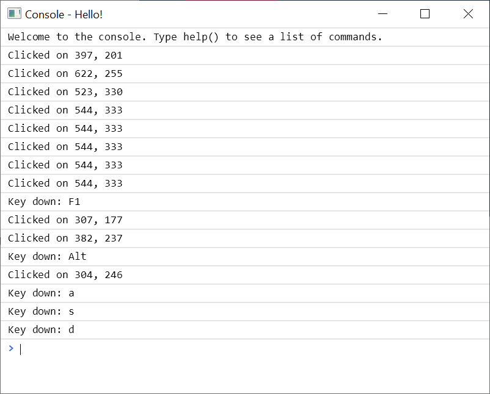
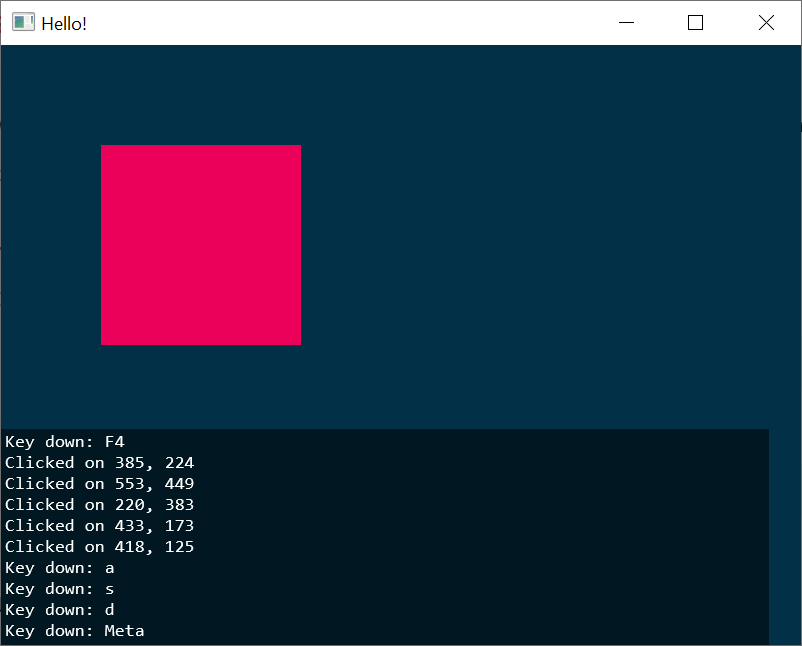
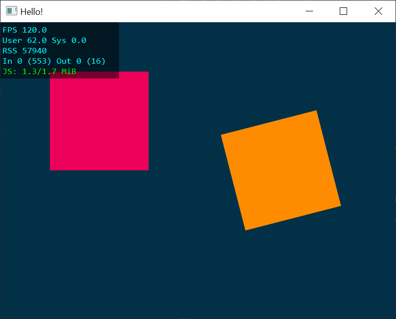

Getting started
===============


Getting a Window.js binary
--------------------------

The first step is to get a working binary.

Window.js is distributed as a single binary that can be
[downloaded](/download) for Windows and macOS.

It can also be [built](/dev/build) from the sources for Windows, macOS and
Linux.


Hello, world!
-------------

Create a new, empty file named `hello.js` and run it with Window.js:

```shell
$ windowjs.exe hello.js
```

This opens a blank window. Edit `hello.js` to update the window title:

```javascript
window.title = "Hello!";
```

Press `F5` in the main window to reload it and verify that the title was
updated.

Now let's clear the background and draw a square:

```javascript
const canvas = window.canvas;
canvas.fillStyle = '#023047';
canvas.fillRect(0, 0, canvas.width, canvas.height);

canvas.fillStyle = '#eb005a';
canvas.fillRect(100, 100, 200, 200);
```

Press `F5` again to reload and see the updated window:

<p align="center"></p>

Use [window.addEventListener](/doc/window#window.addEventListener) to listen
for keyboard and click events:

```javascript
window.addEventListener('click', function(event) {
  console.log(`Clicked on ${event.x}, ${event.y}`);
});

window.addEventListener('keydown', function(event) {
  console.log(`Key down: ${event.key}`);
});
```

After reloading with `F5` again, clicks and keyboard events will log to the
Javascript console. Press `F1` to open the console and see the output:

<p align="center"></p>

The console logs can also be seen overlaid in the main window by pressing
`F4`:

<p align="center"></p>

It's also possible to make API calls in the console directly. Try changing
the mouse cursor via the console:

```javascript
window.cursor = 'crosshair';
```


Drawing continuously
--------------------

Animations can be performed by drawing continuously. This can be done via a
callback to [requestAnimationFrame](/doc/global#requestAnimationFrame):

```javascript
function draw() {
  canvas.fillStyle = '#023047';
  canvas.fillRect(0, 0, canvas.width, canvas.height);

  canvas.fillStyle = '#eb005a';
  canvas.fillRect(100, 100, 200, 200);

  canvas.fillStyle = 'darkorange';
  const y = canvas.height / 2;
  const w = canvas.width;
  const t = Math.cos(performance.now() / 300);
  const x = w / 2 + (w / 4) * t;
  canvas.save();
  canvas.translate(x, y);
  canvas.rotate(t * Math.PI / 2);
  canvas.fillRect(-100, -100, 200, 200);
  canvas.restore();

  // Request to draw again when the next frame is ready.
  requestAnimationFrame(draw);
}

requestAnimationFrame(draw);
```

Press `F2` to see an FPS display. By default, Window.js waits for vsync before
each frame; set [window.vsync](/doc/window#window.vsync) to `false` to draw
as fast as possible.

<p align="center"></p>

The complete `Hello, world!` example is available in the Window.js checkout at
`examples/hello.js`.
